# Disaster Response Simulator - Technical Documentation

## Table of Contents
1. [Project Overview](#project-overview)
2. [System Architecture](#system-architecture)
3. [Code Implementation](#code-implementation)
4. [Training Process](#training-process)
5. [Visualization System](#visualization-system)
6. [Technical Specifications](#technical-specifications)
7. [Future Improvements](#future-improvements)

## Project Overview

The Disaster Response Simulator is a Reinforcement Learning (RL) based system that simulates disaster management in a virtual city. The system uses a Proximal Policy Optimization (PPO) agent to learn optimal strategies for responding to disasters, minimizing damage and casualties.

### System Flow Diagram
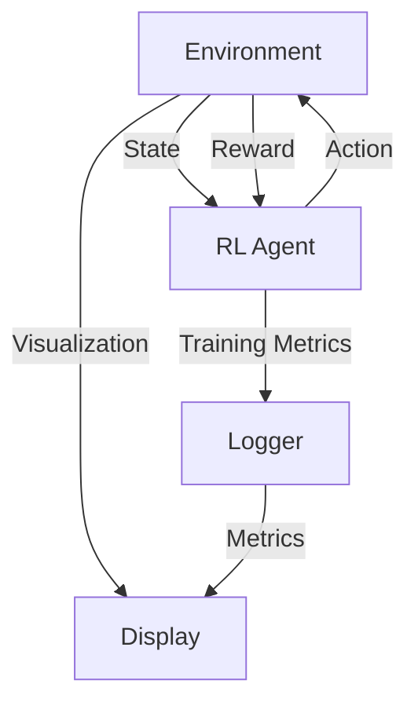

### Key Features
- Grid-based city simulation
- Dynamic disaster spread
- Population and infrastructure tracking
- Real-time visualization
- Automated response strategies

## System Architecture

### 1. Environment Layer
The environment is implemented as a custom Gymnasium environment with the following components:

#### State Representation
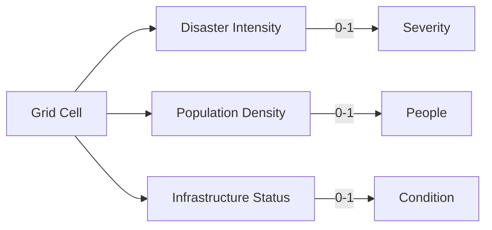

Each cell in the grid contains three values:
- **Disaster Intensity** (0-1): Represents the severity of disaster
- **Population Density** (0-1): Represents the number of people
- **Infrastructure Status** (0-1): Represents the condition of infrastructure

#### Action Space
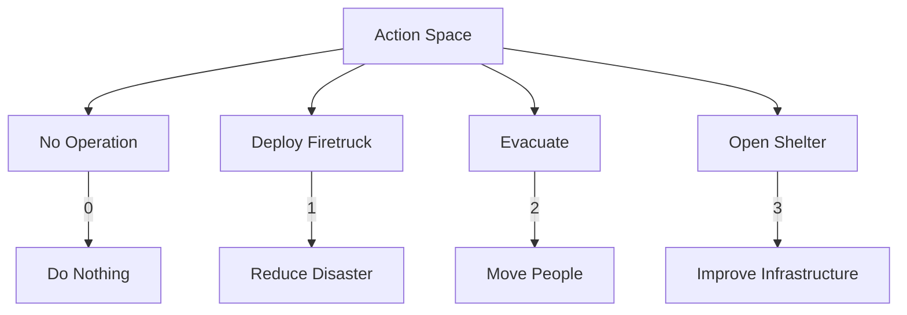

The agent can take four actions:
1. **No Operation** (0)
2. **Deploy Firetruck** (1)
3. **Evacuate** (2)
4. **Open Shelter** (3)

#### Reward System
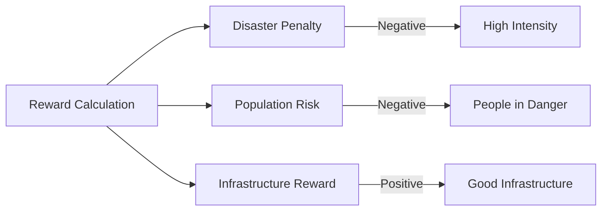

The reward function considers:
- Disaster intensity (negative reward)
- Population risk (negative reward)
- Infrastructure status (positive reward)

### 2. RL Agent Layer
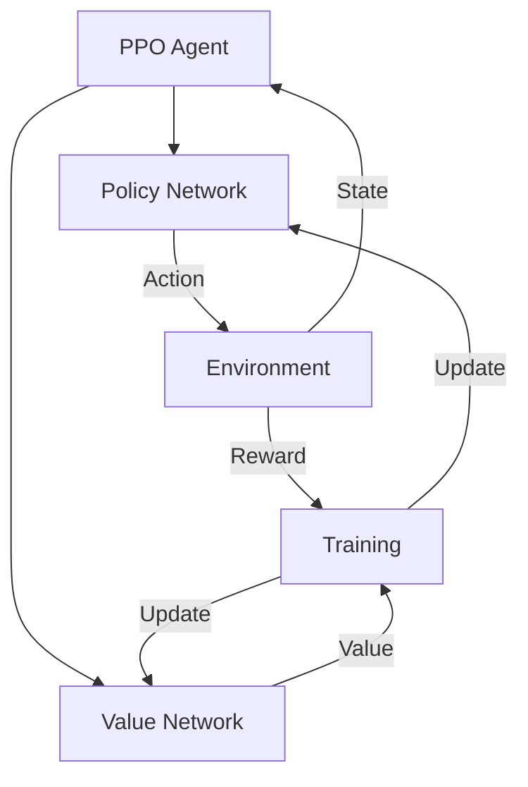

The PPO agent implementation includes:
- Policy network
- Value network
- Experience collection
- Policy updates
- Model saving/loading

### 3. Visualization Layer
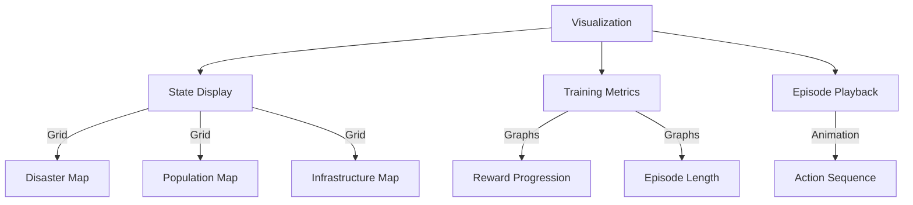

The visualization system provides:
- Real-time state visualization
- Training metrics
- Episode playback
- Performance analysis

## Code Implementation

### 1. Environment Implementation (`environment/disaster_env.py`)

```python
class DisasterEnv(gym.Env):
    def __init__(self, grid_size=10):
        # Environment parameters
        self.grid_size = grid_size
        self.max_steps = 100
        
        # Action space: 4 discrete actions
        self.action_space = spaces.Discrete(4)
        
        # Observation space: grid of cells with 3 features
        self.observation_space = spaces.Box(
            low=0,
            high=1,
            shape=(grid_size, grid_size, 3),
            dtype=np.float32
        )
```

### Training Process Flow
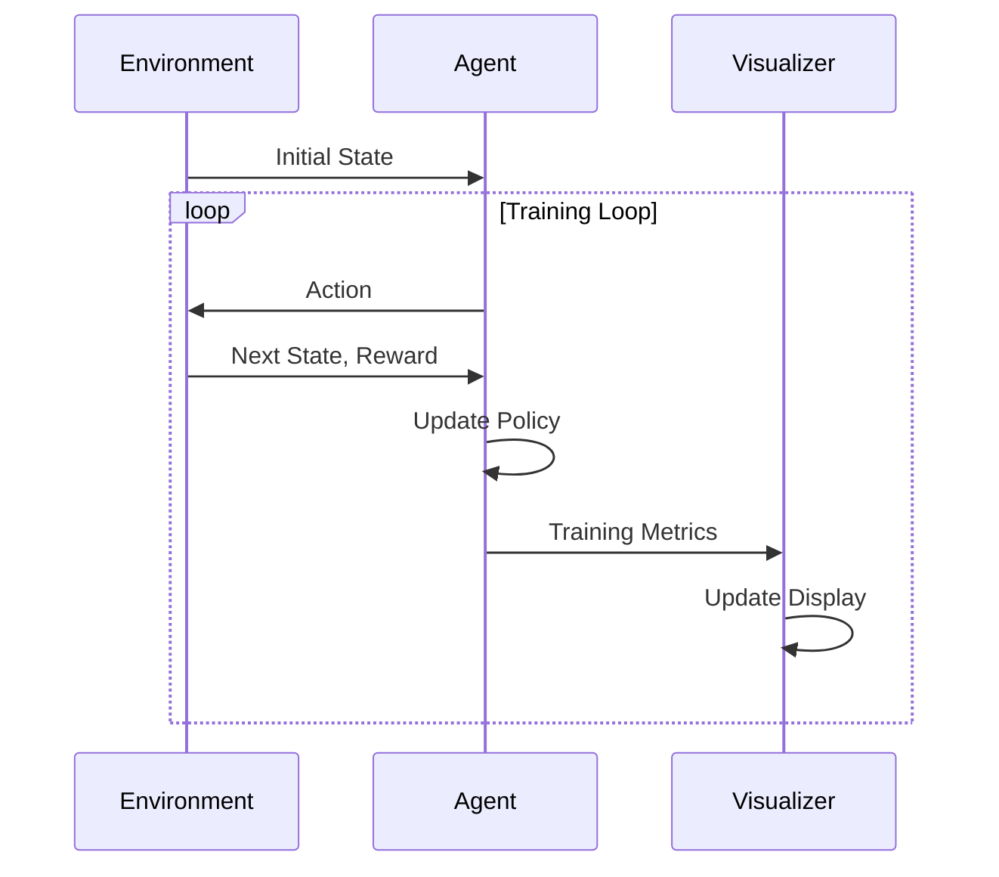

Key Methods:
- `reset()`: Initializes new episode
- `step(action)`: Executes action and updates state
- `_update_disaster()`: Implements disaster spread
- `_calculate_reward()`: Computes reward

### 2. RL Agent Implementation (`agents/rl_agent.py`)

```python
class RLAgent:
    def __init__(self, env, model_path="models/ppo_disaster"):
        self.env = env
        self.model_path = model_path
        self.model = None
        
    def create_model(self):
        self.model = PPO(
            "MlpPolicy",
            self.env,
            learning_rate=3e-4,
            n_steps=2048,
            batch_size=64,
            n_epochs=10,
            gamma=0.99
        )
```

### Agent Architecture
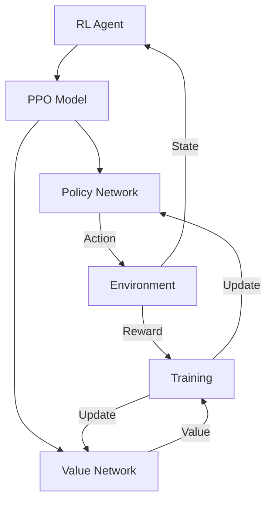

Key Methods:
- `train()`: Implements training loop
- `evaluate()`: Assesses agent performance
- `predict()`: Generates actions
- `save_model()`: Saves trained model

### 3. Visualization Implementation (`utils/visualization.py`)

```python
def visualize_state(state, title="Disaster Environment State"):
    fig, axes = plt.subplots(1, 3, figsize=(15, 5))
    # Disaster intensity
    im0 = axes[0].imshow(state[:, :, 0], cmap='Reds')
    # Population density
    im1 = axes[1].imshow(state[:, :, 1], cmap='Blues')
    # Infrastructure
    im2 = axes[2].imshow(state[:, :, 2], cmap='Greens')
```

### Visualization Flow
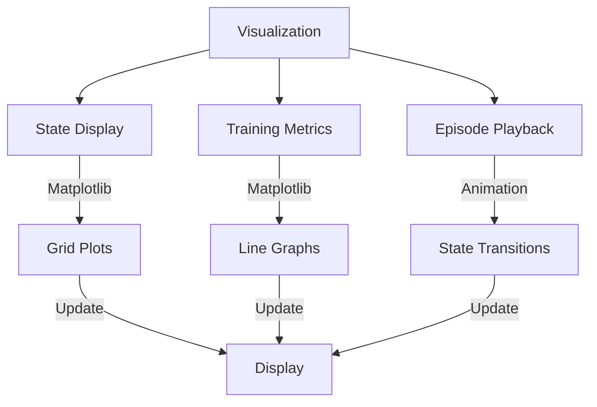

Key Functions:
- `visualize_state()`: Shows current environment state
- `visualize_episode()`: Animates complete episode
- `plot_training_metrics()`: Displays training progress

## Training Process

### 1. Training Pipeline
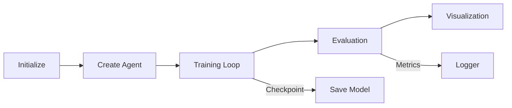

1. Environment initialization
2. Agent creation
3. Training loop execution
4. Model evaluation
5. Performance visualization

### 2. Hyperparameters


- Learning rate: 3e-4
- Number of steps: 2048
- Batch size: 64
- Number of epochs: 10
- Gamma: 0.99
- GAE lambda: 0.95
- Clip range: 0.2
- Entropy coefficient: 0.01

### 3. Evaluation Metrics
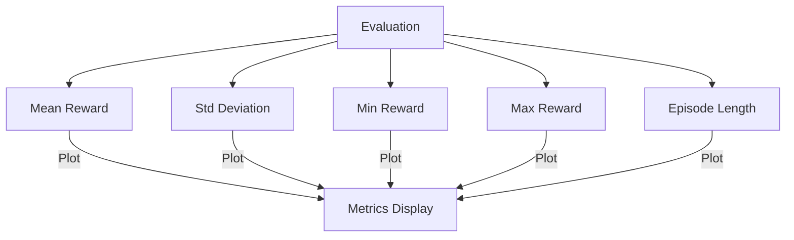

- Mean reward
- Standard deviation
- Minimum reward
- Maximum reward
- Episode length

## Visualization System

### 1. State Visualization
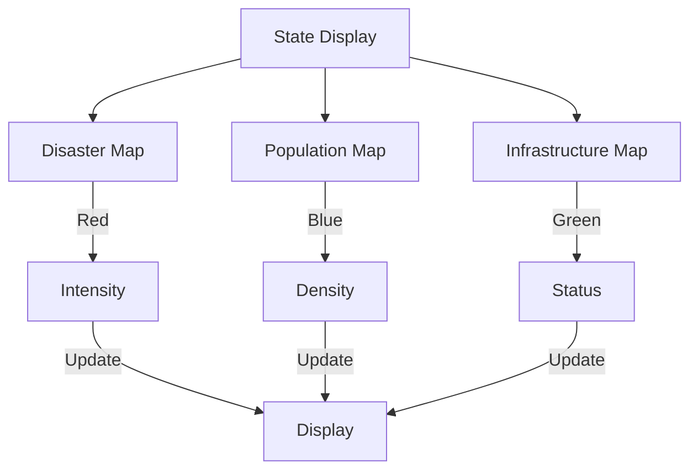

- Disaster intensity (red)
- Population density (blue)
- Infrastructure status (green)

### 2. Training Metrics
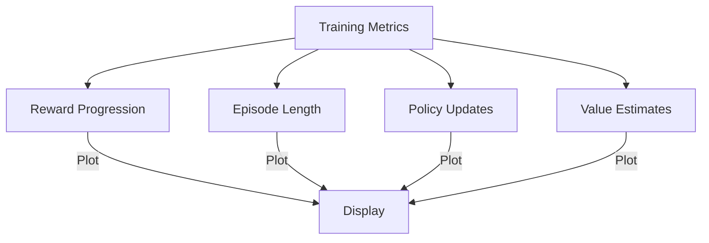

- Reward progression
- Episode length
- Policy updates
- Value function estimates

### 3. Episode Playback
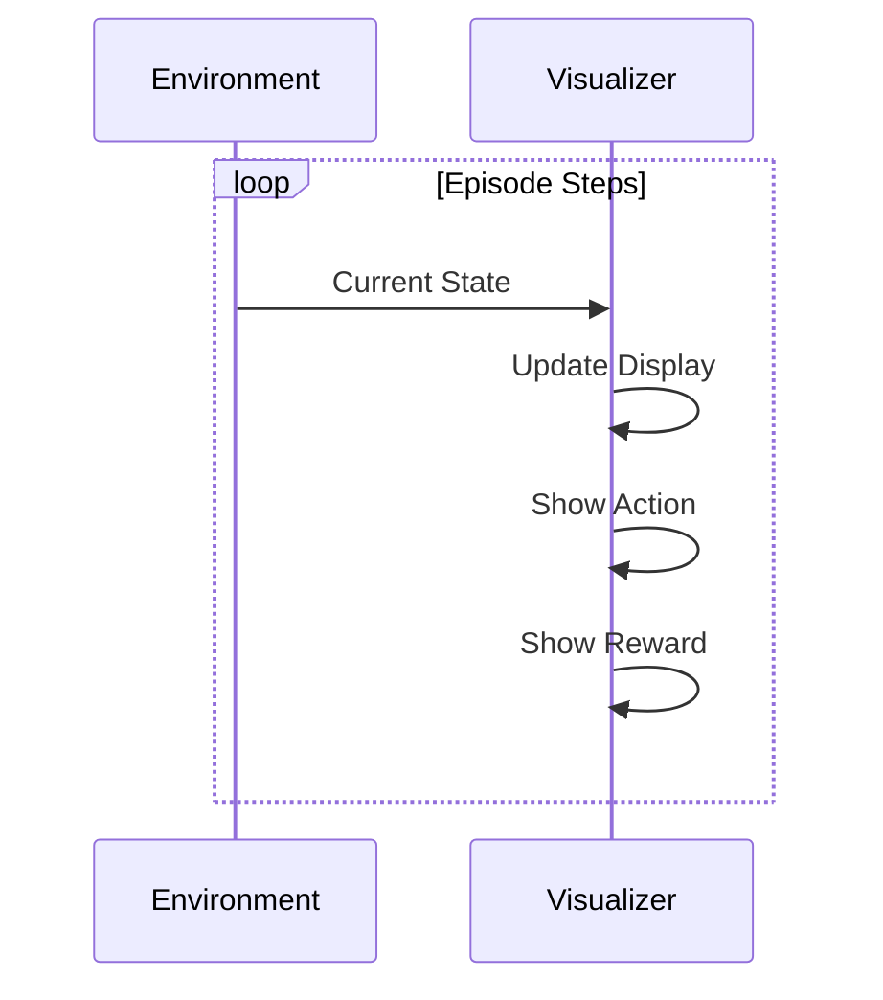

- Real-time action visualization
- State transitions
- Reward accumulation

## Technical Specifications

### 1. Dependencies
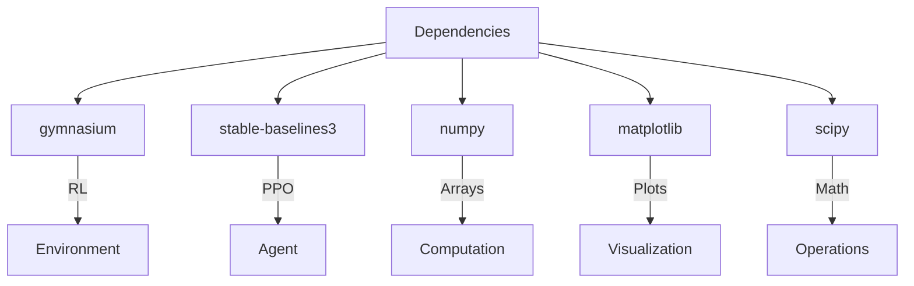

```python
gymnasium>=0.29.1
stable-baselines3>=2.2.1
numpy>=1.24.0
matplotlib>=3.7.0
scipy>=1.10.0
```

### 2. System Requirements
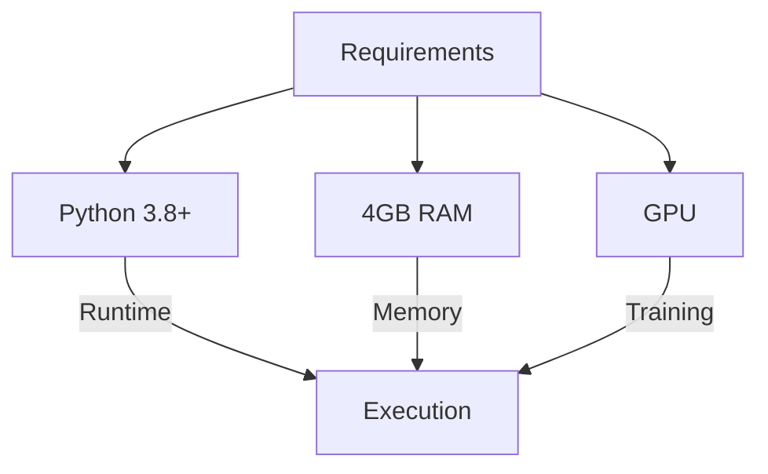

- Python 3.8+
- 4GB RAM minimum
- GPU recommended for training

### 3. File Structure
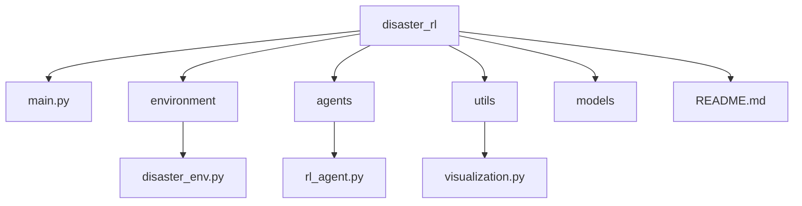

```
disaster_rl/
├── main.py                      # Entry point
├── environment/
│   └── disaster_env.py          # Gym environment
├── agents/
│   └── rl_agent.py              # PPO training wrapper
├── utils/
│   └── visualization.py         # Grid visualizer
├── models/                      # Saved RL models
└── README.md
```

## Future Improvements

### 1. Enhanced Environment
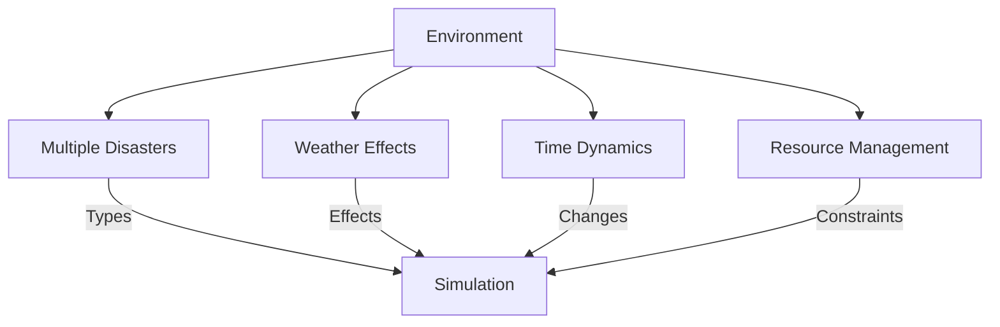

- Multiple disaster types
- Weather effects
- Time-dependent dynamics
- Resource management

### 2. Advanced RL Features
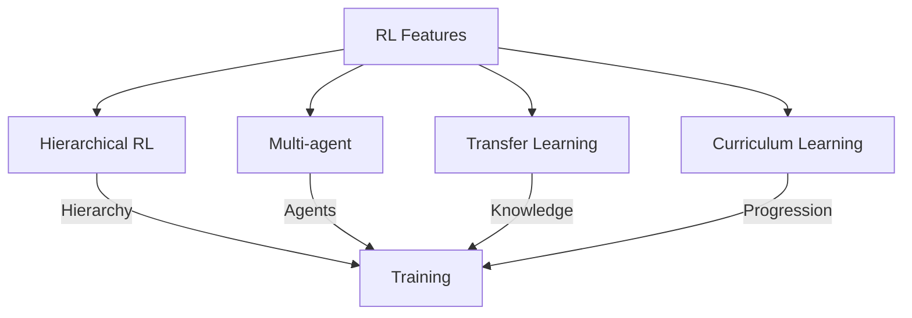

- Hierarchical RL
- Multi-agent systems
- Transfer learning
- Curriculum learning

### 3. Visualization Enhancements
```mermaid
graph TD
    A[Visualization] --> B[3D View]
    A --> C[Interactive]
    A --> D[Real-time]
    A --> E[Geographic]
    B -->|Depth| F[Display]
    C -->|Controls| F
    D -->|Updates| F
    E -->|Maps| F
```

- 3D visualization
- Interactive controls
- Real-time metrics
- Geographic mapping

### 4. Additional Features
```mermaid
graph TD
    A[Features] --> B[Scenario Gen]
    A --> C[Benchmarking]
    A --> D[Auto Tuning]
    A --> E[Distributed]
    B -->|Scenarios| F[System]
    C -->|Performance| F
    D -->|Parameters| F
    E -->|Training| F
```

- Scenario generation
- Performance benchmarking
- Automated hyperparameter tuning
- Distributed training

## Conclusion

The Disaster Response Simulator provides a robust framework for studying disaster management through reinforcement learning. The modular design allows for easy extension and modification, while the visualization system enables clear understanding of the agent's behavior and performance.